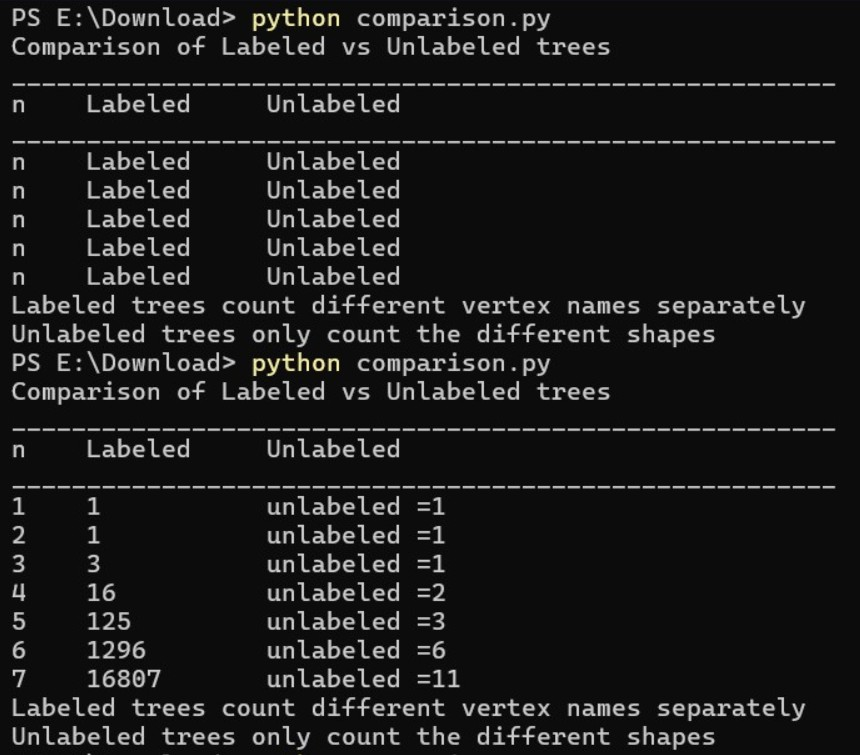
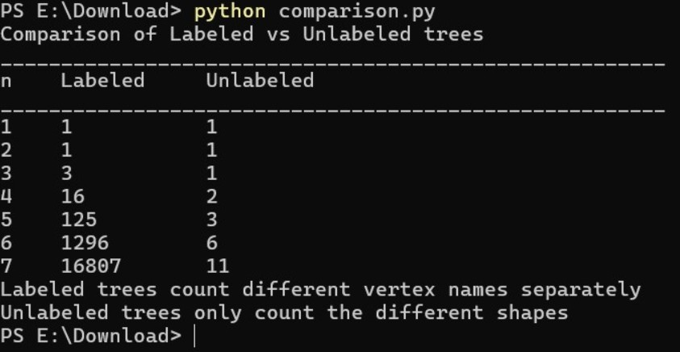

# COMP359 — Assignment 3: Work Log

This file documents the **process** of building each part of the assignment — what was run, what came out, what went wrong, and how it was fixed. Screenshots are included as direct evidence of the terminal output at each stage.

---

## Member 2 — comparison.py (Labeled vs Unlabeled Trees)

### What Was Built

A script that compares labeled tree counts (using Cayley's formula n^(n−2)) against unlabeled tree counts for n = 1 to 7. Unlabeled counts are hardcoded from OEIS A000055.

### First Run — Bug Found

The first run produced incorrect output. The unlabeled column was printing text like `unlabeled =1` instead of just the number:

  


### Final Run — Correct Output

The table now prints correctly with clean integer values in both columns.

  


---

## Member 3 — decode_prufer.py (Prüfer Code Decoding)

### What Was Built

A function `decode_prufer(code)` that takes a Prüfer sequence and returns an edge list reconstructing the labeled tree. A second function `decode_prufer_verbose(code)` prints each step of the algorithm for teaching and debugging purposes.

### Verbose Step-by-Step Output

`decode_prufer_verbose()` was run on three example codes to verify the algorithm was working correctly before writing tests. The screenshot below shows the full trace for codes `[1, 1]`, `[2, 3]`, and `[1, 1, 3]`:


Each step shows the remaining code, available labels, which leaf is picked, and which edge is added. This trace was later used to find the root cause of the test failures below.

### First Test Run — 2 Failures

```
============================================================
RUNNING TESTS  —  decode_prufer()
============================================================
Test  1 [PASS]  Star centred at 1, n=4
Test  2 [PASS]  Path 1-2-3-4, n=4
Test  3 [FAIL]  Mixed tree, n=5
         Expected : [(1, 2), (1, 3), (3, 4), (3, 5)]
         Got      : [(1, 2), (1, 4), (1, 3), (3, 5)]
Test  4 [PASS]  Path 1-2-3-4-5, n=5
Test  5 [PASS]  Star centred at 3, n=6
Test  6 [PASS]  Minimal tree, n=3
Test  7 [FAIL]  Mixed tree, n=6
         Expected : [(1, 2), (2, 3), (2, 4), (4, 5), (4, 6)]
         Got      : [(1, 2), (2, 4), (2, 5), (3, 4), (4, 6)]
------------------------------------------------------------
Results: 5 passed, 2 failed out of 7 tests.
```

### Investigation

The verbose trace above was used to trace `[1, 1, 3]` step by step. At step 2, the remaining code is `[1, 3]` and the available set is `[1, 3, 4, 5]`. The smallest label **not** in the code is `4` — not `3` — because `3` still appears in the remaining code. The algorithm was producing the correct output all along.

### Root Cause

The expected values written manually in the test file were wrong. The edge order had been guessed without fully tracing the algorithm first.

### Fix

```python
# Test 3 — before (wrong)
([1, 1, 3], [(1, 2), (1, 3), (3, 5), (3, 4)])

# Test 3 — after (correct)
([1, 1, 3], [(1, 2), (1, 4), (1, 3), (3, 5)])

# Test 7 — before (wrong)
([2, 4, 2, 4], [(1, 2), (2, 3), (2, 4), (4, 5), (4, 6)])

# Test 7 — after (correct)
([2, 4, 2, 4], [(1, 2), (2, 4), (2, 5), (3, 4), (4, 6)])
```

### Final Test Run — All Passing


7 tests + 2 error-handling tests all passing. The algorithm was correct from the start — only the expected values in the test file needed fixing.

---

## Member 4 — encode_pruferM4.py (Prüfer Code Encoding)

### What Was Built

A function `encode_prufer(tree_edges, n)` that converts a labeled tree into its Prüfer sequence. A `decode_prufer(code)` function was also included to verify round-trip correctness. A `sort_edges()` helper normalises edge direction for comparison.

### Test Run — All Passing First Time

Three trees were tested — two with known expected codes, one without. The screenshot below shows all three passing:


All three confirmed that `encode → decode` gives back the original tree exactly. The round-trip verification proves the bijection is working correctly in both directions — every tree maps to a unique code and back.

---

## Member 5 — generate_trees.py (Tree Generation and Filtering)

### What Was Built

A function `generate_trees(n, max_degree, stop_at)` that generates all Prüfer sequences using `itertools.product`, decodes each using Member 3's `decode_prufer()`, filters by maximum vertex degree, and stops at 100 accepted trees.

### Test Run — All 18 Passing First Time


4 tests for `get_max_degree()` and 14 tests for `generate_trees()` — all 18 passing on the first run. Tests covered n=2 through n=7, edge cases like max_degree=1, stop_at=3, and the n=1 ValueError.

### Main Case Output — n=7

```
n=7 | checked: 191 | accepted: 100 | stopped early: True

  Tree   1: [(1, 4), (1, 5), (1, 2), (2, 6), (2, 3), (3, 7)]
  Tree   2: [(1, 3), (1, 5), (1, 2), (2, 6), (2, 4), (4, 7)]
  Tree   3: [(1, 3), (1, 4), (1, 2), (2, 6), (2, 5), (5, 7)]
  ...
  Tree 100: [(1, 3), (1, 5), (1, 4), (4, 7), (2, 6), (2, 7)]

  [stopped after 100 accepted trees]
```

191 Prüfer sequences were checked out of 823,543 possible before hitting the 100-tree limit.

---

## Member 6 — tree_visualization.py (Drawing Trees)

### What Was Built

A script that loads the 100 accepted trees from Member 5 (via a JSON file), builds a NetworkX graph for each, and draws them with 7 distinct colours replacing numeric labels. Each tree is saved as a PNG image.

### Colour Mapping

```python
colors = ['red', 'blue', 'green', 'orange', 'purple', 'cyan', 'magenta']
node_color_map = {i+1: colors[i] for i in range(7)}
```

Vertex 1 is always red, vertex 2 always blue, and so on — so the same vertex keeps its colour across all 100 images, making it easy to compare structures visually.

### Final Run Output

```
Loaded 100 accepted trees
Saved 100 tree images successfully!
```

100 PNG files saved (tree_1.png through tree_100.png) in the results/ folder, each showing...

---

## Summary

| Member | File | Tests | First Run | Bugs Found | Final Status |
|--------|------|-------|-----------|------------|--------------|
| 2 | comparison.py | manual | failed | 1 — unlabeled column formatting | Fixed ✓ |
| 3 | decode_prufer.py | 7 + 2 error | 5/7 passed | 2 — wrong expected values in tests | Fixed ✓ |
| 4 | encode_pruferM4.py | 3 round-trip | all passed | 0 | Passed first run ✓ |
| 5 | generate_trees.py | 18 | all passed | 0 | Passed first run ✓ |
| 6 | tree_visualization.py | manual | all passed | 0 | Passed first run ✓ |
